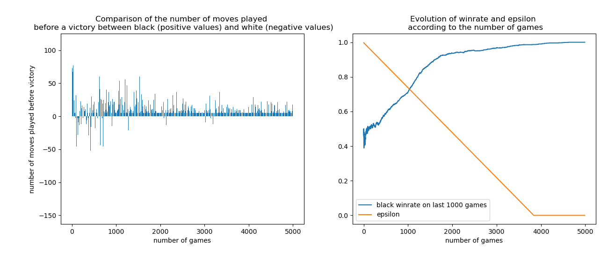

# mutorereAI
----- Blouet Pierre - Le Gal Riwan -----

Version finale du jeu du Mutorere codé en python opposant deux agents :

- un agent effectuant des déplacements aléatoires
- un agent entrainé par un algorithme de renforcement (Q learning)

----- Principe du Q learning -----

Pour rendre notre agent intelligent nous nous sommes appuyé sur le système de Q learning.
Cette technique permet de mesurer la qualité d'une action en fonction de l'état de l'environement
dans lequel se trouve l'agent.

L'agent "intelligent" obtient une reward positive lorsqu'il porte un coup fatal à son adversaire
et qu'il gagne la partie. Il reçoit une reward négative lorsqu'il effectue une action impossible
ou alors lorsqu'il perd la partie.

Une version du code opposant deux joueurs effectuant tous les deux des actions
aléatoires est également disponible dans le code :
	Pour y accéder il faut décommenter la ligne 307 ("# playGameRandomly")
	et commenter la ligne 308 ("playQLearningBlack(5000)")

----- Lancement du script -----
- python mutorere.py

----- Avec 1 mois de plus -----
- Optimisation des hyperparamètres.
- Pouvoir prendre la place du joueur "aléatoire" pour pouvoir se mesurer à l'agent intelligent

----- Résultats -----

